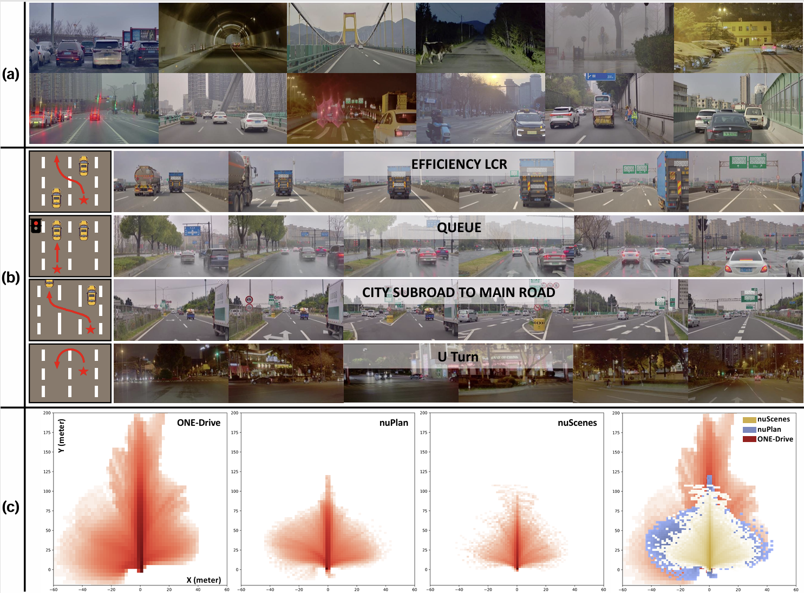
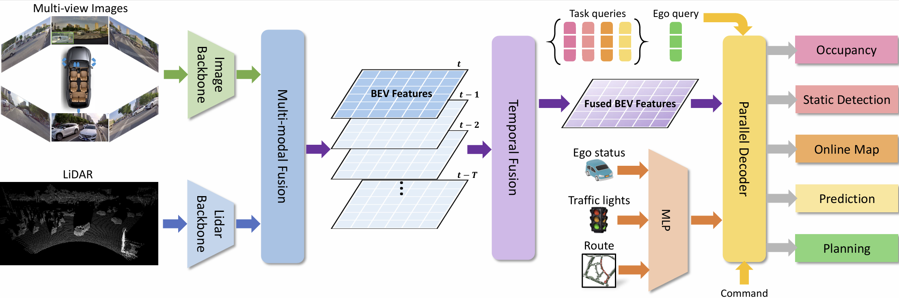
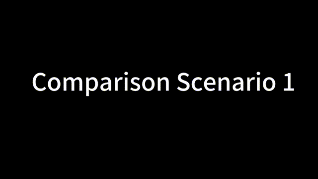
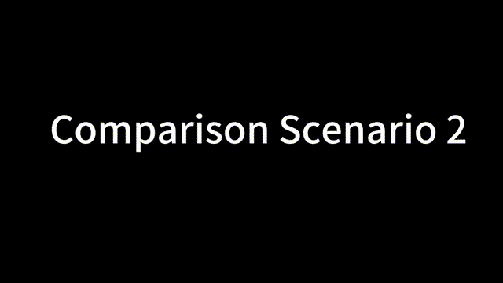
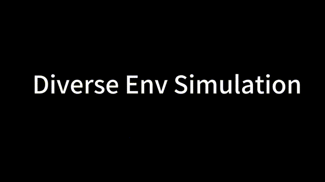

# Preliminary Investigation into Data Scaling Laws for Imitation Learning-Based End-to-End Autonomous Driving

## Abstract
The end-to-end autonomous driving paradigm has recently attracted lots of attention due to its scalability. However, existing methods are constrained by the limited scale of real-world data, which hinders a comprehensive exploration of the scaling laws associated with end-to-end autonomous driving. To address this issue, we collected substantial data from various driving scenarios and behaviors and conducted an extensive study on the scaling laws of existing imitation learning-based end-to-end autonomous driving paradigms. Specifically, approximately 4 million demonstrations from 23 different scenario types were gathered, amounting to over 30,000 hours of driving demonstrations. We performed open-loop evaluations and closed-loop simulation evaluations in 1,400 diverse driving demonstrations (1,300 for open-loop and 100 for closed-loop) under stringent assessment conditions. Through experimental analysis, we discovered that (1) the performance of the driving model exhibits a power-law relationship with the amount of training data;  (2) a small increase in the quantity of long-tailed data can significantly improve the performance for the corresponding scenarios; (3) appropriate scaling of data enables the model to achieve combinatorial generalization in novel scenes and actions. Our results highlight the critical role of data scaling in improving the generalizability of models across diverse autonomous driving scenarios, assuring safe deployment in the real world. Project repository: https://github.com/ucaszyp/Driving-Scaling-Law

## Method

 

## Quantitative Results

## Qualitative Results
 

## Simulation Demo
### Comparison Scenario1: 

### Comparison Scenario2: 

### Simulation Demonstration: 

## Real-world Deployment

